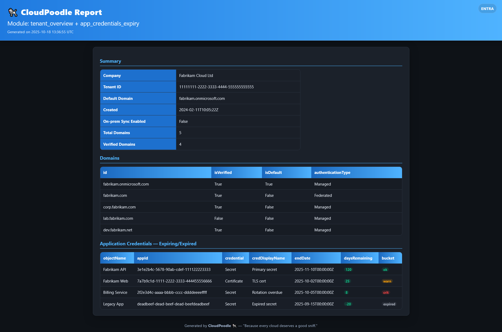
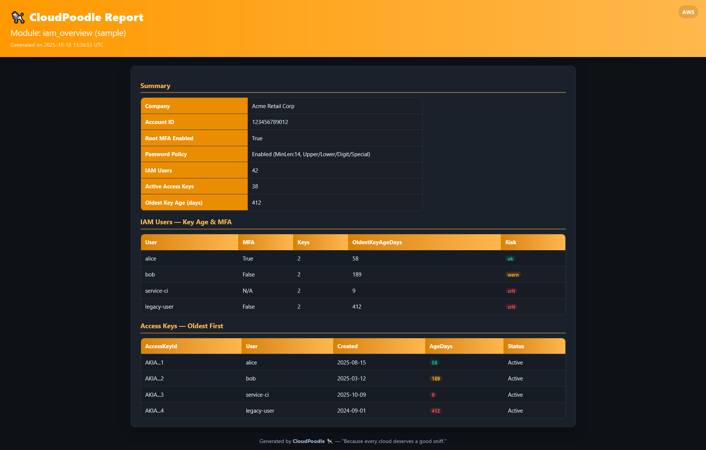

# 🐩 CloudPoodle - Modular Cloud Auditing Framework

> “Because every cloud deserves a good sniff.”

CloudPoodle is a modular cloud security and compliance auditing framework built in Python.  
It provides a unified interface for pulling, analysing, and reporting metadata from multiple cloud identity providers, starting with **Microsoft Entra (Azure AD)**, and extending to **AWS**, **Google Cloud**, and **Oracle Cloud**.

---

## ✨ Features (Current & Planned)

| Module | Status | Description |
|---------|--------|-------------|
| **Entra (Azure AD)** | ⚠ Working On | Enumerates tenant, domains, app credentials, and configuration. |
| **AWS** | 🚧 Planned | Read-only inventory of IAM users, access keys, and security posture. |
| **GCP** | 🚧 Planned | Organisation policies, IAM bindings, and service account audit. |
| **Oracle Cloud** | 🚧 Planned | IAM compartment summary and API key hygiene check. |

---

## 📦 Architecture

CloudPoodle is modular by design:

```

CloudPoodle/
├─ core/
│  ├─ utils.py              ← shared helpers (printing, tables, exports)
│  ├─ reporting.py          ← HTML & CSV/JSON reporting engine
│  ├─ exports.py            ← unified export logic
│  └─ ...
├─ graph_handler/
│  ├─ client.py             ← Microsoft Graph client (Entra)
│  └─ graph_helpers.py      ← reusable Graph query utilities
├─ modules/
│  └─ entra/
│     ├─ tenant_overview.py ← Tenant metadata + domain enumeration
│     └─ app_credentials_expiry.py ← Detect expiring app credentials
└─ CloudPoodle.py           ← main CLI entry point

```

Each module runs independently and can export results as **HTML**, **CSV**, or **JSON**,  
or be chained into a **multi-module HTML report**.

---

## ⚙️ Core Features

- **Interactive authentication** if credentials are missing  
  (`Client ID`, `Tenant ID`, and `Secret` are requested securely)
- **Microsoft Graph integration** with retry and graceful error handling
- **Colour-coded HTML reports** with provider-specific theming  
  *(Entra blue, AWS orange, GCP blue, Oracle red)*
- **JSON + CSV sidecar exports** for data reuse
- **Extensible module system** simply drop a new script under `modules/` and register via `add_args()`

---

## 📊 Example Output

### CLI Summary
```

CloudPoodle v1.0 - "Because every cloud deserves a good sniff."

[•] Following the Graph scent trail into Azure AD…
[✓] Tenant Overview module complete.

````

### HTML Report

Each report is auto-themed per provider and includes:
- Header badge with provider logo (Base64 embedded)
- Tabular summaries with auto-wrapping columns
- Coloured risk “pills” for days-remaining thresholds  
  (🟢 OK > 30 days, 🟠 Warning < 30, 🔴 Critical < 10)





---

## 🔧 Usage

```bash
# Example: Run the Entra tenant overview
python CloudPoodle.py tenant_overview --export entra_domains.csv --html entra_report.html
````

### Optional arguments

| Flag         | Description                              |
| ------------ | ---------------------------------------- |
| `--export`   | Export data to `.csv` and `.json`        |
| `--html`     | Generate a themed HTML report            |
| `--provider` | Override provider (entra/aws/gcp/oracle) |

### Environment Variables

| Variable              | Purpose                          |
| --------------------- | -------------------------------- |
| `CLOUDPOODLE_CLIENT_ID`     | Entra app registration Client ID |
| `CLOUDPOODLE_TENANT_ID`     | Entra Tenant ID                  |
| `CLOUDPOODLE_CLIENT_SECRET` | Entra Client Secret              |

If any variables are not provided, CloudPoodle drops into **interactive mode** and temporarily stores missing credentials in memory.

---

## 🧩 Planned Modules

| Provider   | Module                | Description                                                  |
| ---------- | --------------------- | ------------------------------------------------------------ |
| **Entra**  | `app_roles_audit`     | Enumerate application role assignments and consented scopes. |
| **AWS**    | `iam_overview`        | Enumerate IAM users, policies, and access key age.           |
| **GCP**    | `sa_audit`            | Detect over-privileged service accounts.                     |
| **Oracle** | `compartment_summary` | Display tenancy layout and security posture.                 |

---

## 📁 Reports

All reports are saved to:

```
~/.cloudpoodle/reports/<timestamp>/<module_name>/
```

Multi-module reports combine results into tabbed HTML views for fast review.

---

## 🧠 Developer Notes

* Module entry points must define:

  ```python
  def add_args(subparsers): ...
  def run(client, args): ...
  ```
* Exports and reports are automatically handled by `core.exports`.
* Colourful logging and witty messages are powered by `fncPrintMessage()` in `core.utils`.

---

## 🚀 Future Roadmap

* [ ] AWS IAM integration
* [ ] GCP Cloud Resource Manager integration
* [ ] Oracle Cloud Identity & Access module
* [ ] PDF report generation
* [ ] Scheduling / automated mode
* [ ] Plugin discovery via `entry_points`

---
